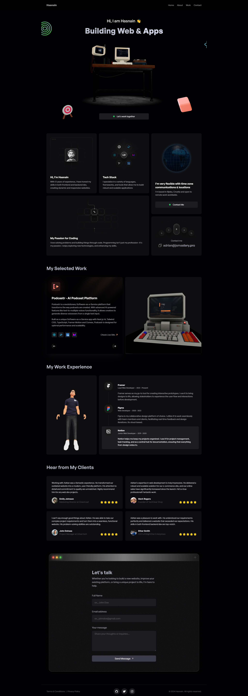

<h3 align="center">A 3D Dev Portfolio</h3>

<div align="center">
    
    
    
    
</div>

## <a name="tech-stack">⚙️ Tech Stack</a>

- React.js
- Three.js
- JavaScript
- Email JS
- CSS
- HTML

## <a name="quick-start">🤸 Quick Start</a>

Follow these steps to set up the project locally on your machine.

**Prerequisites**

Make sure you have the following installed on your machine:

- [Git](https://git-scm.com/)
- [Node.js](https://nodejs.org/en)
- [npm](https://www.npmjs.com/) (Node Package Manager)

**Cloning the Repository**

```bash
git clone https://github.com/Hasnainqari/threejs-portfolio.git
cd threejs-portfolio
```

**Installation**

Install the project dependencies using npm:

```bash
npm install
```

**Running the Project**

```bash
npm run dev
```

Open [http://localhost:5173](http://localhost:5173) in your browser to view the project.


